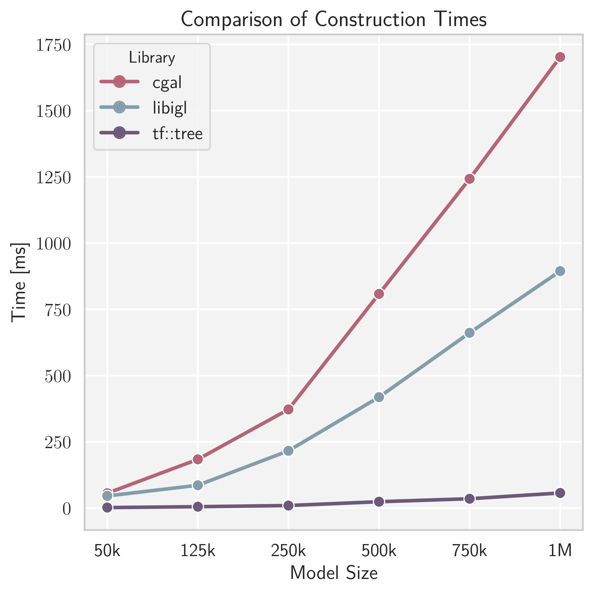
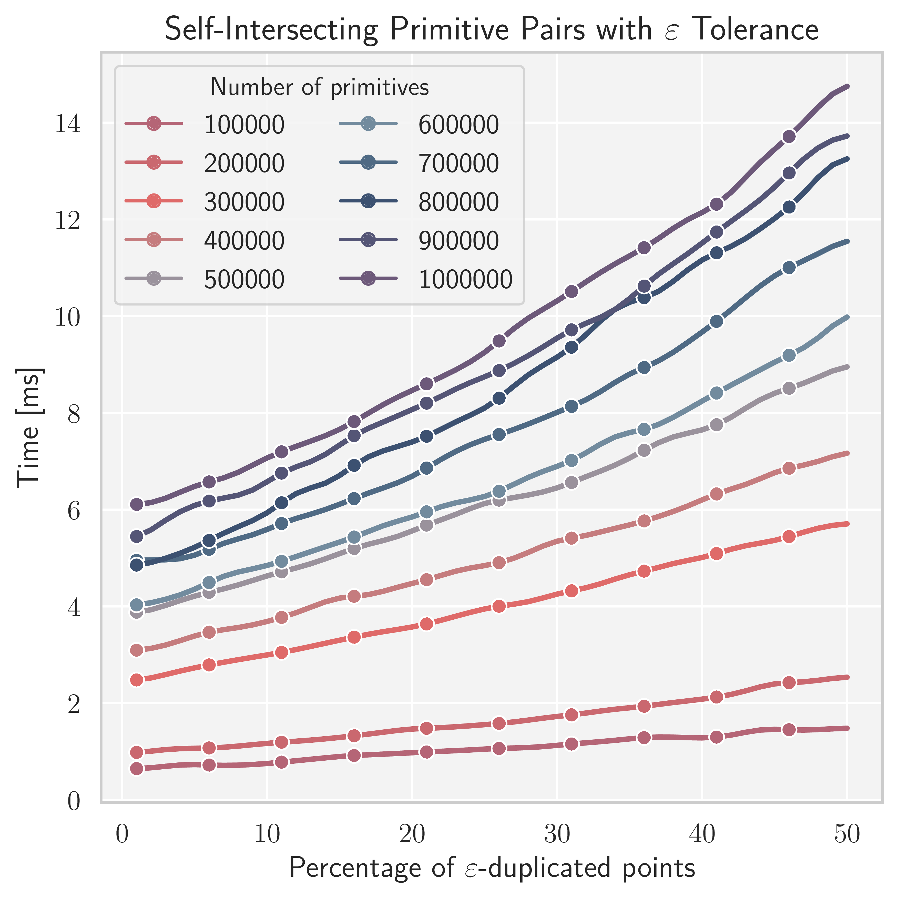
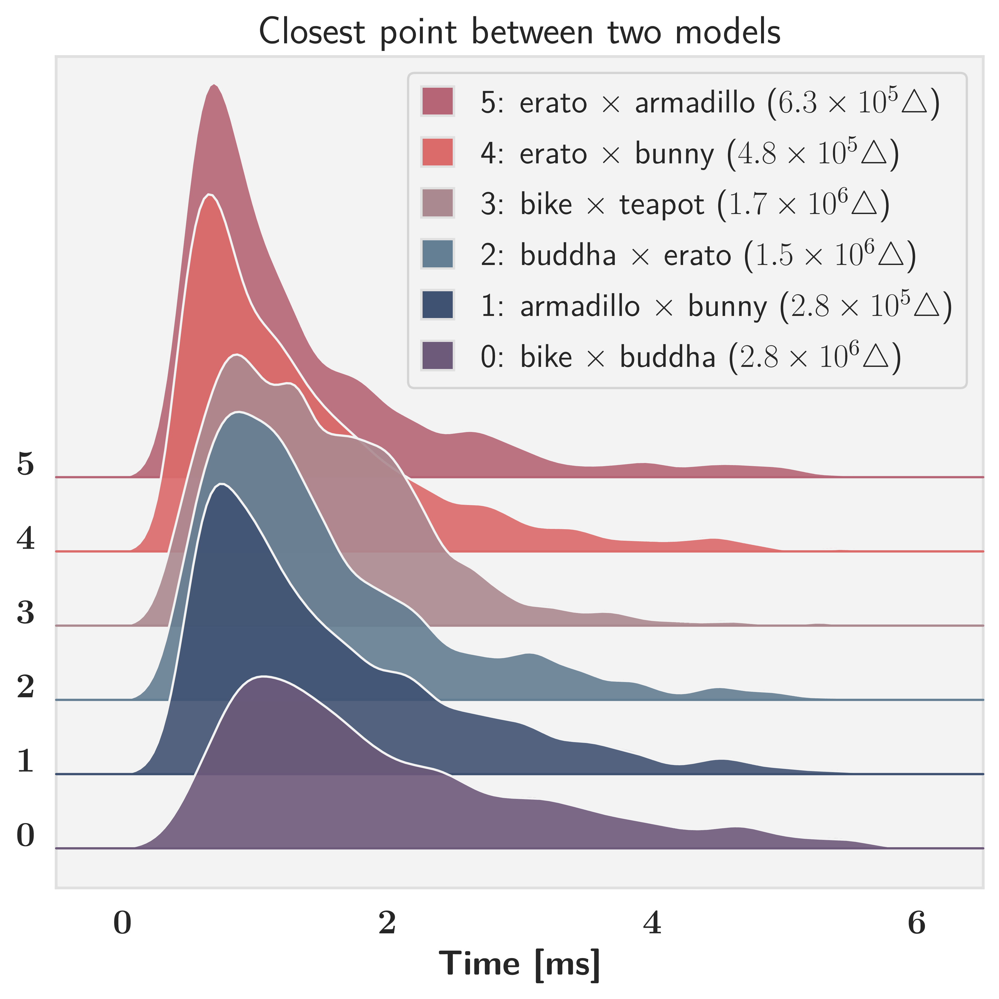
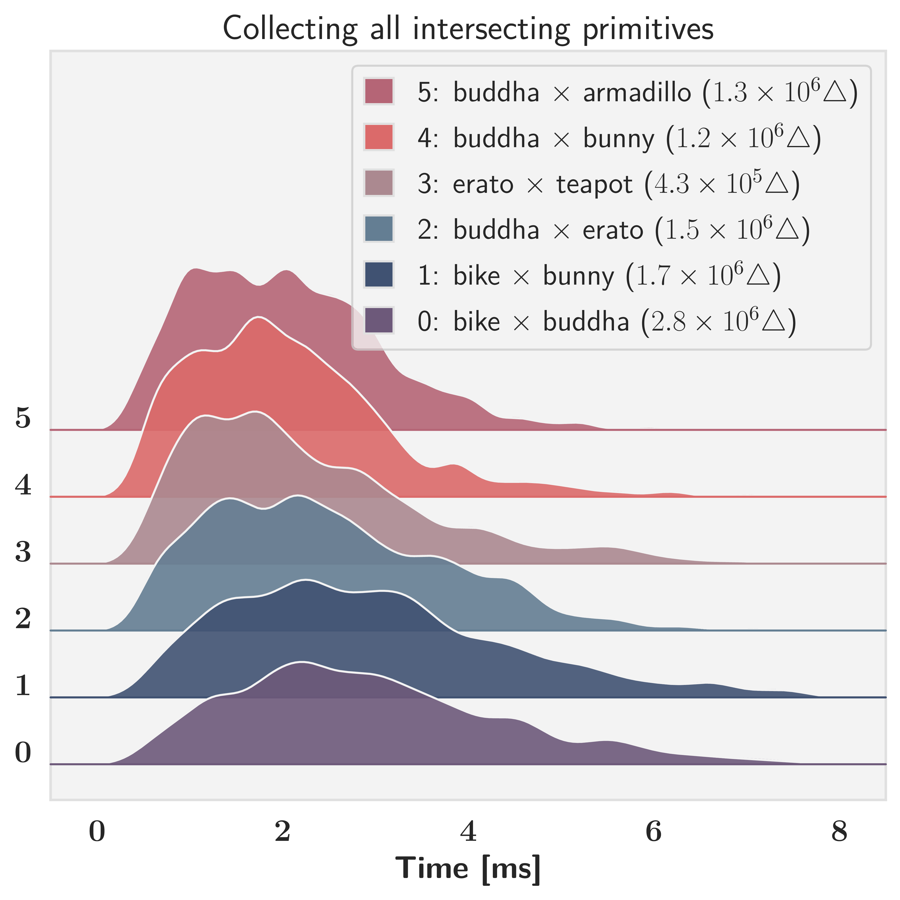

# trueform

**High-Performance Geometry Processing**

This repository is a growing collection of fast, production-grade tools for general-purpose geometric computing.

For usage examples and benchmarks, see the [Features](#-features) section.

---

## 🔧 How to Use

`trueform` is a modern C++17 header-only library and is designed to be simple to integrate.

### 📦 Requirements

- C++17 or later
- CMake ≥ 3.14
- TBB (Threading Building Blocks)


### 🛠️ CMake Integration

#### Using FetchContent

Add this to your `CMakeLists.txt`:

```cmake
include(FetchContent)

FetchContent_Declare(
  trueform
  GIT_REPOSITORY https://github.com/xlabmedical/trueform.git
  GIT_TAG        main
)

FetchContent_MakeAvailable(trueform)

target_link_libraries(my_target PRIVATE tf::trueform)
```

### Examples

Examples are located in the directory [examples](./examples/). To build them, run:

```bash
mkdir build
cd build
cmake ..
make examples -j8
```
---

# ✨ Features


## 📦 tf::tree

**A General-Purpose Spatial Hierarchy for Real-Time Geometry Queries.**

`tf::tree` is written in modern C++ with an STL-inspired interface. Its behavior, from construction to queries, is fully customizable using lambdas. This allows you to easily build trees over any kind of primitives and inject custom behaviour, like transformations or filtering, directly into the query.

For a comprehensive discussion of methodology, benchmarking, and implementation, refer to our [technical paper (PDF)](papers/tree.pdf).

---

### 🔨 Building the Tree

Trees are built from geometric primitives (e.g. triangles) using a parallel partitioning strategy. You can control leaf size, branching factor, and the partitioning algorithm.

📎 **Example:** [`build_tree.cpp`](./examples/build_tree.cpp)  
Builds one spatial tree from an input mesh and one from its points (taken as a point cloud).

---

### 🔍 Search Queries

Supports search queries between: 
- A primitive and a tree
- Two trees
- A tree and itself (for self-intersection or duplication detection)

📎 **Examples:**
- [`search_tree_by_primitive.cpp`](./examples/search_tree_by_primitive.cpp)  
  Finds the all triangles within epsilon of a query point.
- [`search_tree_by_tree.cpp`](./examples/search_tree_by_tree.cpp)  
  Finds all primitive-id pairs within epsilon of each other.
- [`search_tree_by_tree_collision.cpp`](./examples/search_tree_by_tree_collision.cpp)  
  Finds first collision of primitives within epsilon of each other.
- [`search_tree_by_self.cpp`](./examples/search_tree_by_self.cpp)  
  Finds all primitive-id pairs within epislon of each other in a point cloud.

---

### 🌌 Nearness Queries

Supports nearness queries between:
- A primitive and a tree
- Two trees

📎 **Examples:**
- [`nearness_search_tree_by_primitive.cpp`](./examples/nearness_search_tree_by_primitive.cpp)  
  Finds the closest point (and knn) on the triangle mesh to a query point.
- [`nearness_search_tree_by_tree.cpp`](./examples/nearness_search_tree_by_tree.cpp)  
  Finds a closest point pair (and knn) between two point clouds.

---

### 📊Benchmarks

The evaluations below were compiled with *Clang 18* using maximum optimization settings. Benchmarks were conducted on an `Intel i7-9750H` CPU with 6 physical cores.


<p align="center">
  
  
</p>

**Left:** Construction time comparison between <code>tf::tree</code>, CGAL, and libigl.  
**Right:** Performance of <code>tf::tree</code> on ε-self-intersection detection. Each curve shows query time over varying rates of duplicated points perturbed by ε.

<p align="center">
  
  
</p>

Distributions generated from 10,000 randomized relative placements of model pairs.  
**Left:** Closest-point queries with non-intersecting configurations.  
**Right:** Intersection queries with intersecting configurations.
